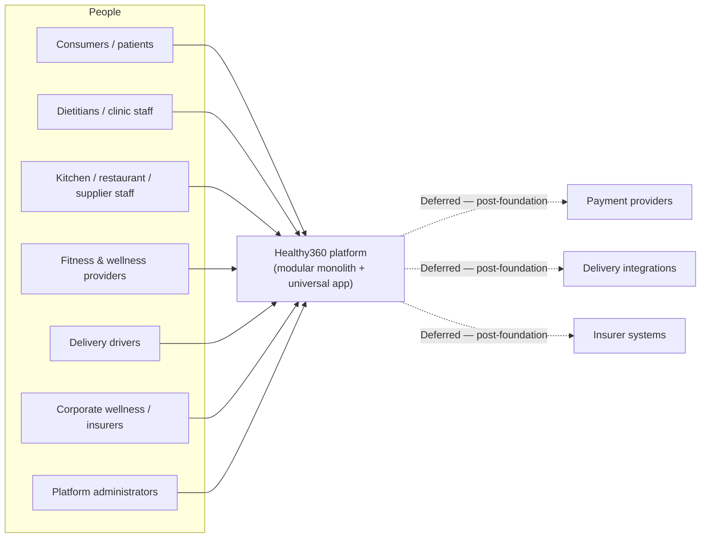
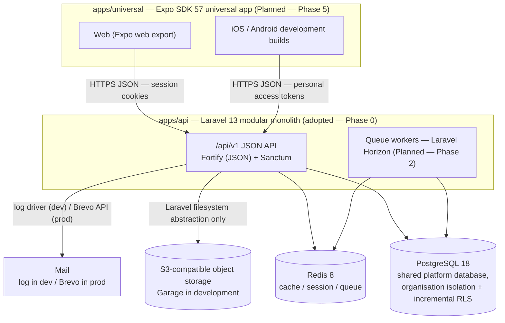

# 01 — System Context and Containers

> Status: Phase 1 architecture baseline. Only the Laravel application at `apps/api/` exists today (Phase 0). All other containers are marked with their delivery phase.

## System context (C4 level 1)

All external integrations (payment, delivery, insurers) are **explicitly deferred**. No integration tables (`integration_connections`, `webhook_events`) are migrated in this phase; future integration points appear here only so the context is honest about where the system will eventually connect.

## Containers (C4 level 2)

### Container summary

| Container | Technology | Responsibilities | Status |
| --- | --- | --- | --- |
| Universal app | Expo SDK 57, Expo Router, TypeScript 6, TanStack Query | All user interfaces on web, iOS and Android; role-aware routing; client-side guards (UX only) | Planned — Phase 5 |
| API monolith | Laravel 13, PHP 8.4, Fortify (JSON responses), Sanctum | Authentication, tenancy context, RBAC, all business logic; the single source of authority | Adopted — Phase 0; converted incrementally in Phases 3–4 |
| Queue workers | Laravel Horizon over Redis | Background jobs with correct tenant-context restoration | Planned — Phase 2 (infrastructure), Phase 6 (context tests) |
| Database | PostgreSQL 18 | Shared platform database; application-level scoping first, then representative Row-Level Security | Planned — Phase 2 |
| Cache/queue | Redis 8 | Cache, sessions and queues | Planned — Phase 2 |
| Object storage | Garage (dev) or approved S3-compatible service | File storage behind Laravel filesystem abstractions — no Garage-specific API dependencies | Planned — Phase 2 |
| Mail | `log` mailer in dev (writes to `storage/logs/laravel.log`); Brevo (symfony/brevo-mailer) for real delivery | Local email capture (verification, password reset) | Adopted |

### Universal app build families

One Expo codebase, differentiated at build time. Only these build-time modes exist:

| Mode | Audience | Phase 1 expectation |
| --- | --- | --- |
| `customer` | Consumers / patients | Production-ready configuration |
| `staff` | Professional and organisational staff | Production-ready configuration |
| `kiosk` | POS / self-service | Shell/prototype only until hardware and offline requirements are known |
| `driver` | Delivery drivers | Shell/prototype only |
| `all-dev` | Developers | Production-ready configuration (development builds) |

## Decision: modular monolith

- **Problem.** A multi-actor platform of this breadth invites premature service decomposition, which would multiply infrastructure, contracts and failure modes before a single workflow is proven.
- **Recommendation.** Build one Laravel modular monolith with enforced internal module boundaries (see `02-module-boundaries.md`) and one shared PostgreSQL database with organisation isolation. **Microservices are prohibited in this phase.**
- **Benefit.** One deployment, one transaction boundary, one test suite; module boundaries preserve the option to extract services later without committing to distribution now.
- **Implementation impact.** Module discipline is enforced through the module system (or the `app/Modules/` fallback), dependency rules and CI, rather than network boundaries.
- **Risk of omission.** Without the explicit prohibition, incidental service extraction would fragment the foundation before the vertical slice proves the architecture.
- **MVP status.** Adopted; binding for the whole foundation phase. Recorded as ADR-001.
