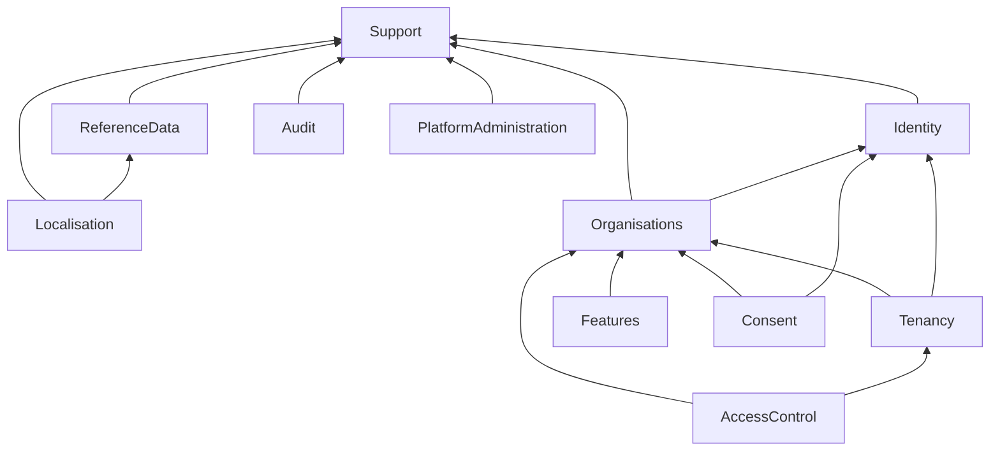

# 02 — Module Boundaries

> Status: living architecture document. The eleven active platform modules are implemented; kitchen-programme modules land phase by phase per the Order-Kitchen master plan. Table-to-module ownership below follows the grouping in the foundation plan's database scope.

## Rules

1. Application modules exist **only** for implemented foundation domains. There are eleven.
2. A module may depend on **Support** and on the **declared public contracts** of other modules. A module must never import another module's models, internal classes or tables directly.
3. Future modules are recorded in the module registry as documentation only — **no empty directories, no speculative classes, no premature tables**.
4. A package or module contains a working implementation, a concrete interface used by another package, or a clearly documented deferred contract — never scaffolding for its own sake.

## Status vocabulary

Every entry in `docs/architecture/module-registry.yaml` carries exactly one status (master plan v2 §4.1). The architecture test `apps/api/app-modules/support/tests/ModuleRegistryTest.php` enforces the column on the right.

| Status | Meaning | May hold code |
|---|---|---|
| `planned` | Documented intent only — no directory, no classes, no migrations, no routes | No |
| `foundation` | Schema and internal management exist; the customer-facing lifecycle may still be incomplete | Yes |
| `active` | The declared capability is complete through an approved API or UI surface | Yes |
| `deprecated` | Superseded; still present, no new consumers | Decided when the first module reaches it |
| `retired` | Withdrawn; the entry survives so the name is never reused | No |

`active` permits code, it does not require it: **Localisation** and **PlatformAdministration** are registry-only entries whose declared capability is the entry itself, and they stay registry-only. A status change and the architecture test that enforces it land in the **same commit**, always.

## The 11 active platform modules

All public contracts listed are Planned (Phase 3 unless noted); they are the *only* surface other modules may consume.

| Module | Purpose | Owned tables | Public contracts (planned) | Allowed dependencies |
| --- | --- | --- | --- | --- |
| **Support** | Shared kernel: central UUIDv7 identifier service, response envelopes, correlation IDs, data-classification enum, base module contracts, idempotency handling | `idempotency_keys` | Identifier service; envelope/error primitives; correlation accessor; data-classification enum | None (depends on framework only) |
| **ReferenceData** | Stable reference data: all ISO countries seeded with only launch markets active; currencies; languages; measurement units | `countries`, `currencies`, `languages`, `measurement_units` | Reference lookups (country/currency/language/unit by ISO code); active-market queries | Support |
| **Localisation** | Locale negotiation (`Accept-Language`), English/Arabic support, locale-aware formatting on the API side | — (uses ReferenceData `languages`) | Locale resolver; formatting helpers | Support, ReferenceData contracts |
| **Identity** | Global user identity: one person, one account, many organisations; profiles; registered devices | `users`, `user_profiles`, `user_devices` | Current-user hydration; user lookup; device registration/listing/revocation (Phase 4) | Support |
| **Organisations** | Organisations, their types, capabilities, branches and user memberships | `organisation_types`, `organisations`, `organisation_capabilities`, `organisation_branches`, `organisation_memberships` | Membership lookup; branch-in-membership-scope checks; capability queries | Support, Identity contracts |
| **Tenancy** | Resolution and validation of the active context (user + organisation membership + branch); organisation-context middleware; PostgreSQL session context (`app.user_id`, `app.organisation_id`, `app.branch_id`) | — | Current-context accessor; context-selection service (`PUT /api/v1/me/context`, Phase 4); queue-context restoration (Phase 6) | Support, Identity + Organisations contracts |
| **AccessControl** | Roles, permissions, role assignment, the six-step RBAC decision, permission caching and version-counter invalidation | `roles`, `permissions`, `membership_roles`, `role_permissions` | Permission check (`domain.action_scope`); calculated-permission set for `/api/v1/me` | Support, Organisations + Tenancy contracts |
| **Features** | Feature catalogue and per-organisation entitlements driven by subscriptions; evaluated separately from RBAC with its own denial reason | `feature_definitions`, `feature_entitlements`, `organisation_subscriptions` | Entitlement check; entitlement set for `/api/v1/me` (Phase 4) | Support, Organisations contracts |
| **Consent** | Consent definitions and recorded grants; evaluated separately from RBAC with its own denial reason | `consent_definitions`, `consent_grants` | Consent check; consent capture (foundation in Phase 6) | Support, Identity + Organisations contracts |
| **Audit** | Append-only audit events: safe audit-event contract, log redaction, purpose-of-use for sensitive access; the application role cannot update or delete audit rows | `audit_logs` | Audit-event recorder (consumed by all modules) (Phase 6) | Support |
| **PlatformAdministration** | Platform-operator concerns (e.g. platform-level administration of reference data, organisations and features). Phase 1 scope is minimal; the execution sequence does not schedule dedicated work for it beyond the module's existence | — | To be declared when first implemented | Support, other modules' contracts |

Dependency direction is one-way and acyclic: `Support` at the base; `ReferenceData`, `Identity` above it; `Organisations` above `Identity`; `Tenancy`, `AccessControl`, `Features`, `Consent` above `Organisations`; `Audit` is a base-level sink consumed by all.

*(Edges show "depends on the contracts of". `PlatformAdministration` may consume other modules' contracts as they are declared.)*

## Module system: InterNACHI Modular spike gate

- **Problem.** InterNACHI Modular 3 has not been proven against Laravel 13; committing the whole application to it unverified risks a costly reversal.
- **Recommendation.** Run a compatibility spike **before** adoption: create one small `Support` module, then verify (1) Laravel 13 package discovery, (2) migrations, (3) routes, (4) configuration caching, (5) Pest tests, (6) Larastan, (7) production optimisation commands.
- **Benefit.** The module system is chosen on evidence; the application never depends on the package before the spike passes.
- **Implementation impact.** If the spike fails, fall back to project-owned namespace conventions under `app/Modules/` (PSR-4, `Healthy360\` namespace) with the same boundary rules — the module discipline is identical either way.
- **Risk of omission.** Building all eleven modules on an unverified package couples the entire foundation to a third-party assumption.
- **MVP status.** Spike is Planned — Phase 3, gating module implementation.

## Future modules — registry entries only

The following 28 modules are documented in the module registry (`docs/architecture/module-registry.yaml`) and in the future roadmap (`09-future-module-roadmap.md`). They receive **registry entries and documentation only** — no directories, no classes, no migrations — until each is genuinely required and separately designed:

Nutrition, Ingredients, Allergens, Recipes, MealPlanning, Kitchens, Inventory, Procurement, Production, QualityControl, Marketplace, Catalogues, Pricing, Customers, Verification, B2B, Cart, Orders, Subscriptions, Payments, Accounting, POS, KitchenDisplay, Delivery, ClinicalRecords, Appointments, Reporting, ArtificialIntelligence.

Kitchen and commercial permissions likewise remain registry proposals until those modules are implemented.
