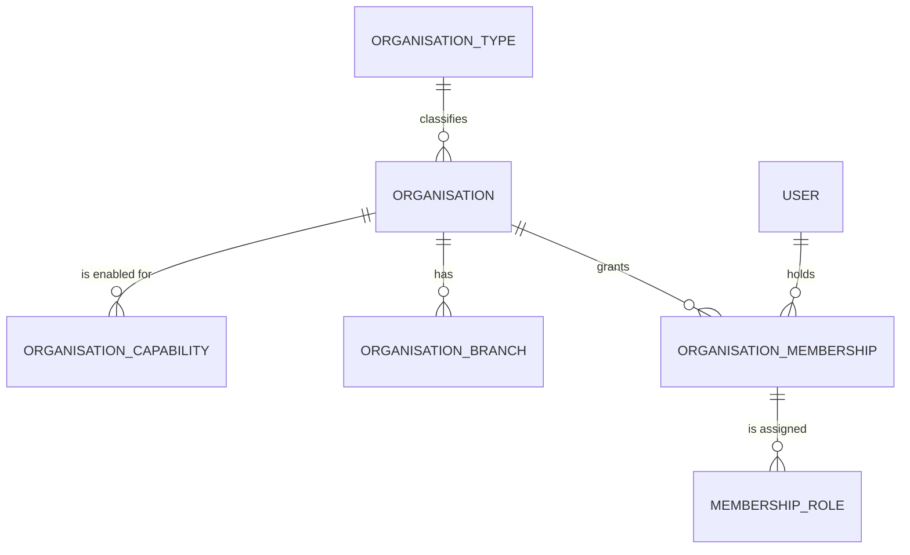
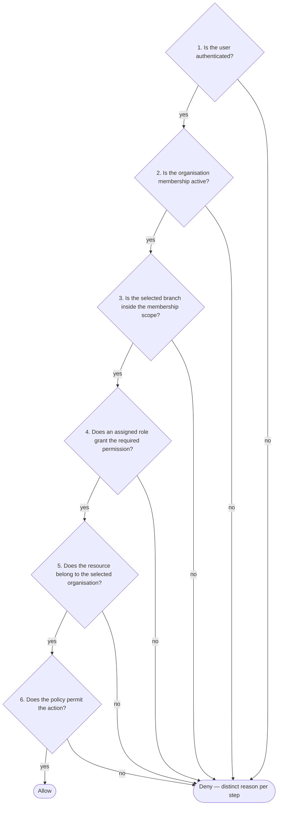

# 03 — Identity, Tenancy and Access

> Status: Phase 1 architecture baseline. Application-level scoping and RBAC are Planned — Phase 3–4; Row-Level Security is Planned — Phase 6.

## Global user identity

A user has **one global Healthy360 identity** and may belong to several organisations through memberships. Real cases the model must support:

- a dietitian working in two clinics;
- a kitchen manager over several branches;
- a patient connected to both a clinic and a kitchen;
- a professional owning an independent practice while employed elsewhere.

Identity (the person) is therefore separate from membership (the person's participation in an organisation). Credentials, profile and devices are global; roles, permissions, entitlements and consent are contextual.

## Organisation model



- **Organisation** — the tenant unit; classified by an organisation type and enabled for capabilities.
- **Branch** — an organisation subdivision; branch selection is part of the working context where applicable.
- **Membership** — the link between a global user and an organisation; roles are assigned to memberships, not to users directly.

## Tenancy context

The working context is always:

```text
Authenticated user
+ Active organisation membership
+ Active branch where applicable
```

Clients declare their intended context via the `X-Organisation-Id` and `X-Branch-Id` headers (see `04-data-and-api-architecture.md`), but **client-provided organisation or branch identifiers are never trusted without server validation**. Organisation-context middleware (Planned — Phase 3) resolves and validates the context on every request: the membership must be active and the branch must fall inside the membership's scope. Context selection is persisted through `PUT /api/v1/me/context` (Planned — Phase 4).

## The RBAC decision

Authorisation is deliberately kept understandable. The core decision is six sequential steps:



### Separated concerns — never one opaque resolver

The following are **evaluated separately from the six-step decision and from each other**, each producing its own distinct denial reason. They must not be folded into a single opaque permission resolver:

| Concern | Question it answers |
| --- | --- |
| Feature capability / subscription entitlement | Is the organisation entitled to this feature at all? |
| Patient–provider relationship | Does a valid care relationship exist? |
| Consent | Has the data subject consented? |
| Professional assignment | Is this professional assigned to this case? |
| Resource ownership | Does the caller own the specific resource? |
| Step-up authentication | Has the user recently re-confirmed their identity? Denial is HTTP 403 with `error.code = auth.step_up_required` (not 423) |
| Regulatory restrictions | Does a jurisdictional rule prohibit the action? |

Each denial reason is stable and testable. The wire-level catalogue of denial codes is defined in `docs/api/conventions.md`; `auth.step_up_required` is the only code fixed by this baseline.

### Initial role behaviour (Phase 1)

| Rule | Detail |
| --- | --- |
| Allow-only | Permissions grant; there are **no general deny rules** in Phase 1. Prohibited actions are expressed as explicit policies, not deny entries |
| Time-bound assignment | Membership-role assignments support optional `starts_at` / `expires_at` |
| Permission naming | `domain.action_scope` — e.g. `organisation.view_current`, `branch.manage_current`, `membership.invite_organisation`, `session.revoke_own`, `user.manage_organisation` |
| Caching | Calculated permissions are cached per (user, organisation, branch); invalidation via a permission-version counter, not manual cache deletion |
| Future permissions | Kitchen and commercial permissions remain registry proposals until those modules exist |

## Incremental Row-Level Security

- **Problem.** A shared PostgreSQL database means one scoping mistake in application code could expose another organisation's data; but introducing RLS everywhere at once, before the basic workflow exists, would make the foundation undebuggable.
- **Recommendation.** Introduce isolation in two layers. **Phase 1A** (with Phase 3 backend core): organisation-context middleware, explicit query scoping, policies, and cross-organisation feature tests. **Phase 1B** (Phase 6): PostgreSQL RLS on a representative table set — `organisation_branches`, `organisation_memberships`, `roles`, `feature_entitlements`, `consent_grants`, `audit_logs` — driven by session context `app.user_id`, `app.organisation_id`, `app.branch_id`.
- **Benefit.** Application scoping is proven first; RLS then adds a database-enforced backstop on the tables that matter most, failing closed when context is absent.
- **Implementation impact.** Three database roles: an owner/migrator role; an application role **without `BYPASSRLS`**; a test role with application-equivalent privileges. There is **no broadly privileged runtime `system` role** in Phase 1 — cross-tenant administrative and background processes must later use explicit, audited service pathways. Queue workers must set and reset session context correctly.
- **Risk of omission.** Without Phase 1B, tenant isolation rests solely on application discipline; without the phased order, RLS failures would be indistinguishable from application bugs during early development.
- **MVP status.** Phase 1A Planned — Phase 3; Phase 1B Planned — Phase 6, gated on the vertical slice already passing. Recorded as ADR-007.

### RLS verification tests (Phase 6 gate)

1. **No context fails closed** — a connection without session context reads and writes nothing on protected tables.
2. **Cross-organisation isolation** — a user cannot read or update another organisation's data.
3. **Queue context** — queued jobs restore the correct tenant context before touching the database.
4. **Connection reuse** — pooled/reused connections do not retain a previous tenant's context.
5. **Migrations** — migrations run under the owner/migrator role without application-runtime privileges.

RLS must fail closed **and** must not break the previously accepted vertical slice.

### Explicit non-goal

Do **not** implement a generic SQL-listener rule asserting that every statement contains an organisation predicate. It produces false positives and duplicates what RLS provides.
