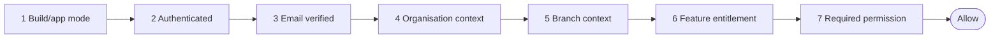
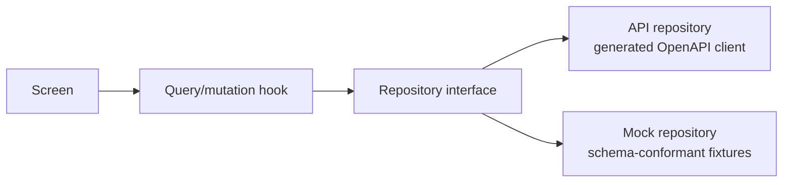

# 05 — Universal Frontend

Status: Baseline — Phase 1 (platform foundation). Derived from the authoritative foundation plan (§3, §16–§21, §25). Implementation lands in execution Phase 5; this document is the contract that implementation must satisfy.

## 1. Shape

One Expo project, `apps/universal/`, targets web, iOS and Android from a single codebase. There is no separate web application and no per-role application.

| Concern | Decision |
| --- | --- |
| Framework | Expo SDK 57 + Expo Router; React Native 0.86-compatible and React 19.2-compatible Expo dependencies |
| Language | TypeScript 6; Node.js 24 LTS |
| Workspace | pnpm workspaces + Turborepo; shared logic lives in `packages/*` under the `@healthy360/*` scope |
| Server state | TanStack Query |
| Forms and validation | React Hook Form + Zod |
| Internationalisation | i18next / react-i18next (see §8) |
| Bundle identifiers | `com.healthy360.*` |
| Acceptance | The vertical slice (register/login → email verification → organisation selection → branch selection → permission hydration → workspace) runs against the real Laravel API on web **and** on at least one native development build |

## 2. Build families

Build-time modes select which role areas are compiled and enabled.

| Mode | Audience | Phase 1 status |
| --- | --- | --- |
| `customer` | Consumers, patients | Production-ready configuration |
| `staff` | Organisation staff (clinic, kitchen, partner, corporate, insurance, platform admin) | Production-ready configuration |
| `kiosk` | POS and KDS hardware | Prototype shell only — no production configuration |
| `driver` | Delivery drivers | Prototype shell only — no production configuration |
| `all-dev` | Developers and QA (every area enabled) | Production-ready configuration, internal distribution only |

POS, KDS and driver modes remain shells until their hardware and offline requirements are known (plan §16, §21). Building production configuration for them now would encode unvalidated assumptions.

## 3. Role areas

The route registry recognises exactly these fourteen areas:

`public`, `auth`, `customer`, `patient`, `dietitian`, `clinic`, `kitchen`, `pos`, `kds`, `driver`, `partner`, `corporate`, `insurance`, `platform-admin`.

Areas are registry entries, not promises of screens. An area existing in the registry does not entitle it to routes, components or navigation beyond what §4 defines.

## 4. Phase 1 screens

Only the following screens are functional (wired to the real API) in Phase 1:

| Screen | Area | Notes |
| --- | --- | --- |
| Login | auth | Fortify JSON endpoints |
| Registration | auth | |
| Email verification status | auth | Pending / verified / resend |
| Forgotten password | auth | |
| Reset password | auth | |
| Session restoration | auth | Silent re-hydration on launch |
| Organisation picker | auth → workspace | From `/api/v1/me/memberships` |
| Branch picker | auth → workspace | Where the membership has branch scope |
| Workspace selector | workspace | Entry into the role area shell |
| Profile summary | workspace | From `/api/v1/me` |
| Device / session management | workspace | List and revoke devices/sessions |
| Forbidden page | shared | Renders guard denial reasons (§5) |
| Not-found page | shared | |
| Design-system showcase | all-dev only | Exercises every §7 component in en/ar, light/dark |

Every other area renders **one consistent prototype state**: a single shared placeholder screen with area-aware copy. Do not generate dozens of empty pages (plan §16).

## 5. Access guards

### 5.1 Permission kernel

One framework-independent permission kernel lives in `@healthy360/permissions`. It imports nothing from React, React Native or Expo, so it is unit-testable under Vitest and reusable by any renderer.

### 5.2 Evaluation order

Checks run in a fixed order; the first failure wins and yields a stable denial reason.

| Step | Denial reason (indicative — final identifiers are fixed in `@healthy360/permissions`) |
| --- | --- |
| Build/application mode | `mode_unavailable` |
| Authentication state | `unauthenticated` |
| Email verification | `email_unverified` |
| Organisation context | `organisation_context_required` |
| Branch context | `branch_context_required` |
| Feature entitlement | `feature_not_entitled` |
| Required permission | `permission_denied` |

Denial reasons are stable strings suitable for both automated tests and user-facing display (the forbidden page maps reasons to copy).

### 5.3 Components

| Component | Role |
| --- | --- |
| Protected route layout | Route-level enforcement in Expo Router; redirects or renders the forbidden page |
| `<Gate>` | Declarative block-level guard with denial fallback |
| `<Can>` | Conditional rendering on a required permission |
| `useCan()` | Imperative hook for logic paths |

Client guards improve UX only. **Laravel remains authoritative**: every guarded action is re-authorised server-side, and client checks are never a security boundary.

## 6. Data access

Rules (plan §15, §18):

* Screens never call `fetch` and never import fixtures.
* API and mock repositories satisfy the same TypeScript contract.
* Generated OpenAPI client code is imported **only** by the API repository layer.
* Fixtures must conform to the generated schemas (enforced by conformance tests — see `08-testing-and-quality.md`).
* Mock mode is clearly visible during development (persistent indicator).
* Production builds **fail** when mock mode is enabled (negative test in CI).
* Foundation acceptance runs against the real Laravel API, not mocks.

## 7. Design system scope

### 7.1 Phase 1 components (23 only)

| Group | Components |
| --- | --- |
| Typography and layout | Text, Heading, Stack, Inline |
| Actions | Button, Icon button |
| Forms | Text input, Password input, Checkbox, Form field, Select |
| Content | Card, List item, Badge |
| Status | Spinner, Skeleton, Empty state, Error state, Offline indicator |
| Overlays | Dialog, Drawer, Toast |
| Structure | Application shell |

Deferred: advanced tables, nutrition charts, meal-planner components, kitchen production boards, POS controls, KDS tickets, clinical timelines. These are designed with their owning modules (see `09-future-module-roadmap.md`).

Platform-specific files (`.web.tsx` / `.native.tsx`) are allowed wherever platform behaviour genuinely differs — they are not restricted to primitives.

### 7.1.1 Phase 2 additions

Added for the Prompt 2 prototype. The design system stays **domain-free**: nothing below knows what a meal, a kitchen or a plan is. Domain components (`NutritionFactsPanel`, `MealCard`, `PlanCard`, `MacroSummary`, `AllergenList`) live in `apps/universal/src/features/**`.

| Group | Component | Why it exists, and the decision inside it |
| --- | --- | --- |
| Navigation | `Tabs`, `SegmentedControl` | One behaviour, two chromes. `role="tablist"` with a **roving tab stop** — only the selected tab is focusable, so an eleven-way filter costs one Tab press. Arrow keys are remapped for RTL, because the browser does not do it |
| Navigation | `Stepper` | Wizard progress for up to 22 steps. A counter plus a bar, not 22 dots: 22 labelled nodes cannot fit at 360 px without dropping below the touch minimum. The bar fills from the leading edge by flex source order |
| Navigation | `Breadcrumbs` | Its own named `navigation` landmark (a page has two otherwise). Last crumb is `aria-current="page"` and is not a link |
| Forms | `NumberStepper` | **Replaces the slider.** A drag rail needs a pointer, a bespoke keyboard implementation and a gesture dependency, and cannot be hit accurately at 360 px. Announces as a `spinbutton` carrying its own bounds; two 44 dp buttons; Arrow Up/Down on the web |
| Forms | `RangeFilter` | Two `NumberStepper`s. Crossed values are **reported, not silently swapped** — swapping loses what the user was typing |
| Forms | `DateField` (`.web` / `.native`) | Web: a real `input[type=date]` written as a DOM element, because the browser's picker is already accessible, translated and locale-formatted, and react-native-web's `TextInput` cannot express `type="date"`. Native: three `Select`s (a birth date is 100 years of swiping in a month grid). Shared arithmetic in `date-field-shared.ts`; a non-existent day never rolls over |
| Content | `Chip`, `FilterChip` | Chips reflow by count and width at a constant height — raised to the 44 dp minimum, which both reference products fell short of. `FilterChip` uses `aria-pressed` on the web (`aria-selected` is invalid on a button and axe reports it) and `accessibilityState.selected` on native, which react-native-web ignores |
| Content | `Callout` | The base of the app-level `MedicalDisclaimer` and `PrototypeNotice`. `role` is a prop — a standing disclaimer is a `note`, not an `alert`; making everything an alert teaches users to ignore them |
| Content | `Accordion` | Headers carry `aria-expanded` + `aria-controls`; the panel element always exists so the reference resolves, its contents unmount so a closed panel holds no focusable controls |
| Content | `Avatar`, `ImagePlaceholder` | Generated from a seed hash; **no remote images anywhere**. Initials are taken by code point so Arabic is not split mid-character |
| Data | `Table` | ARIA `table` / `columnheader` / `rowheader` above `md` (react-native-web renders every primitive as a `div`, so the roles *are* the semantics, and they mean the same on native); stacked cards below `md`. A branch, not a responsive class — a hidden copy would be read twice |
| Data | `CalendarGrid` | Headless. Day columns are flex children in source order, so Arabic mirrors for free; **no absolute positioning and no physical inset in the file at all**. Weekday order comes from the caller. Claims no row-based table semantics, because its DOM order is column-major |
| Data | `ProgressRing`, `MeterBar` | Value against target. Drawn from 24 rotated ticks rather than an SVG arc — an SVG library is a native module. **Always a visible numeric label**, and the five-stop nutrition tone always carries its `pattern` marker, so nothing is said by colour alone. The ring's sweep direction flips under RTL |
| Data | `Rating` | Display only — rating submission is a write to a backend that does not exist, and stars that look pressable but do nothing are a dead control. Numeric label always rendered; glyphs hidden from assistive technology |
| Overlays | `Drawer` `placement` | `start` \| `end` \| `bottom`. Resolved by source order inside a flex row/column, never an inset utility. `start` is the default, so Phase 1 behaviour is unchanged |
| Overlays | `ActionSheet` | A thin composition over a bottom `Drawer`, so the focus trap and dismiss contract have one implementation. Closes *before* running the action. Destructive actions carry an icon as well as the danger tone |
| Overlays | `Popover` | Non-modal: focus stays on the trigger, Escape closes, an outside press closes on the web. `trigger="hover"` is **inert on a coarse pointer** — a touch screen has no hover state |
| Status | `Skeleton` `variant` | Adds `shimmer` alongside the default `pulse`. Both collapse to the same static block under reduced motion |
| Structure | `AppShell` `marketplace` | Public chrome: brand slot, horizontal nav at `md`+, menu button below, trailing actions, `contentinfo` footer |
| Structure | `AppShell` `consumer` | Signed-in chrome: sidebar at `lg`+, bottom tabs below — literally the same tab bar as `driver`, so the two cannot drift |
| Motion | `motion/` | `useMotion`, `FadeIn`, `SlideIn`, `Collapse`, `Shimmer`, `useAnimatedNumber`, `PageTransition` — see §7.1.2 |

Two token additions support the motion module: `motionDistances` (a travel scale with reduced-motion zeros, mirroring `durations`) and `staggerDelay` / `MAX_STAGGERED_ITEMS` (an uncapped stagger turns a planner week into a wait). Neither reaches the generated artefacts, so `build:tokens --check` reports no drift.

### 7.1.2 Motion

`useMotion()` answers the only two questions any animation here needs, both of them properties of the *user*: whether motion is wanted at all, and which way "forward" points. `axisSign` is `1` in a left-to-right locale and `-1` in a right-to-left one, and every horizontal offset is multiplied by it — the only mirroring technique that survives a live `dir` flip on the web, because the component re-renders when the locale changes.

Under `prefers-reduced-motion` every duration and distance is **zero** and every component renders its **final style as a literal** (`opacity: 1`, `translateX: 0`) rather than an animated value parked at the final position. That is the defect this design guards against: an animation suppressed while its starting style survives leaves content permanently invisible. It is asserted per component in `motion.test.tsx`.

Motion is built on React Native's `Animated`, not Reanimated. `Animated` is already in use (`Skeleton`), works identically through react-native-web, needs no Babel plugin and adds no dependency to this package — and the package's hard constraint for Prompt 2 is zero new dependencies. `Collapse` is the one component that animates on the JavaScript thread, because height cannot go through the native driver.

### 7.2 Styling: NativeWind is provisional

* **Problem**: A styling approach must work across en/ar (RTL), web/native and light/dark, and a wrong choice is expensive to reverse across a design system.
* **Recommendation**: Use NativeWind provisionally; it becomes mandatory only after passing a spike covering English/Arabic × web/native × light/dark.
* **Benefit**: Utility-first speed without betting the design system on an unproven combination.
* **Implementation impact**: Spike executed at the start of execution Phase 5, before component build-out; tokens in `@healthy360/design-tokens` stay styling-engine-agnostic.
* **Risk of omission**: RTL or theming defects discovered after 23 components are built, forcing a rewrite.
* **MVP status**: Spike is mandatory in Phase 1; NativeWind adoption is conditional on it.

## 8. Internationalisation and RTL

| Capability | Phase 1 |
| --- | --- |
| Locales | English (`en`), Arabic (`ar`), plus a pseudo-locale for expansion/RTL stress testing |
| Locale persistence | Selected locale survives restart |
| Direction | Full RTL for Arabic; direction-aware navigation, chevrons and directional icons |
| Dates and numbers | Locale-aware formatting |
| Numbering system | Configurable (Latin vs Eastern Arabic digits). Latin digits are **not** permanently forced for Arabic users; the default for clinical/financial figures is a recorded management decision (open register item) |
| Translation keys | Typed keys with compile-time checking; missing-translation checks in CI |
| RTL verification | RTL visual tests (see `08-testing-and-quality.md`) |
| Native direction change | Changing layout direction on native may require an application reload; a clear user-facing reload flow is provided rather than a silent or broken transition |

## 9. Offline behaviour (intentionally limited)

Implemented in Phase 1 (plan §21):

* Network-state detection and an offline banner (design-system Offline indicator).
* Retry of failed queries after reconnection.
* Optional persistence of **non-sensitive reference/public catalogue data only**, with cache versioning so stale shapes are discarded on upgrade.

Never persisted on device in Phase 1: clinical records, health assessments, consents, authentication responses, private organisation data, financial information.

Explicitly not built: mutation outbox, offline POS, offline clinical workflows (each requires its own threat model and conflict rules first), and any broad PWA service-worker cache before privacy and invalidation rules are defined.

## 10. Deferred honestly

| Item | Status |
| --- | --- |
| POS / KDS / driver production configuration | Planned — post-Phase 1, after hardware and offline requirements |
| Functional screens beyond §4 | Planned — with their owning modules |
| Passkey UI | Disabled in UI even though Fortify may install supporting dependencies |
| Offline mutations / PWA caching | Deferred pending threat models (plan §21) |
