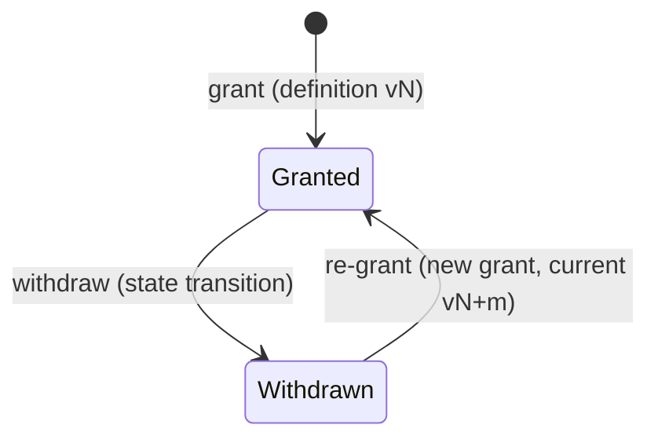

# 06 — Security, Privacy and Audit

Status: Baseline — Phase 1 (platform foundation). Derived from the authoritative foundation plan (§10–§13, §25). Audit controls, redaction, consent foundation and classification land in execution Phase 6; authentication security lands in execution Phase 4.

> **No compliance claim is made.** This document describes technical foundations only. Regulatory validation for each launch market (LB, AE, SA, QA, KW, BH, OM, JO, EG) is a separate workstream with legal counsel; nothing here asserts conformity with any health-data, privacy or consumer law.

## 1. Data classification

A single data-classification enum is applied to fields, DTOs and audit events so redaction, encryption and purpose-of-use rules key off one concept instead of ad-hoc lists.

| Level (concept — final enum fixed in execution Phase 6) | Examples | Handling |
| --- | --- | --- |
| `public` | Country names, published catalogue data | No restriction |
| `internal` | Organisation configuration | Tenant-scoped access only |
| `personal` | Name, email, phone, device metadata | Redacted in logs; RBAC-gated |
| `sensitive_personal` | Health, clinical and consent-related data | Redacted everywhere; purpose-of-use required on access; encryption candidates |
| `secret` | Passwords, tokens, keys | Never logged, never audited as content, never returned by APIs |

## 2. Log redaction and request correlation

* **Central log-redaction processor**: one processor applied to every log channel strips or masks values by classification and by known-sensitive key names. Redaction is not left to individual call sites.
* **Correlation**: the server generates `X-Correlation-Id` and returns it on every response; clients may send `X-Client-Request-Id`. Both propagate into logs, audit events, error envelopes (`error.correlation_id`) and queued jobs so one user action is traceable end to end.

## 3. Audit-event contract

### 3.1 Safe event shape

| Field | Notes |
| --- | --- |
| `id` | UUIDv7 |
| `occurred_at` | UTC |
| `actor_user_id` / actor type | Nullable for system events |
| `organisation_id`, `branch_id` | Tenancy context (RLS-protected — see plan §11) |
| `action` | Stable verb, e.g. `auth.login_failed`, `membership.role_assigned` |
| `subject_type`, `subject_id` | What was acted on |
| `classification` | §1 level of the subject data |
| `purpose_of_use` | Required for sensitive accesses (§3.3) |
| `correlation_id` | Links to request logs |
| `metadata` | Safe, minimal, structured context only |

### 3.2 What must never appear in audit metadata

Raw passwords; session or API tokens; medical content; full request bodies; payment payloads. Audit records reference subjects by identifier — they never duplicate sensitive content.

### 3.3 Purpose-of-use

Accesses to `sensitive_personal` data carry a purpose-of-use value (for example treatment, support, administration — final vocabulary set in execution Phase 6) recorded on the audit event. This is a foundation for later clinical and regulatory work, not a legal control by itself.

### 3.4 Append-only enforcement

* **Problem**: Application-level "append-only" conventions can be bypassed by any code path holding the application's database connection.
* **Recommendation**: Enforce append-only at both layers — application writes audit events through an insert-only service, **and** the PostgreSQL application role is denied `UPDATE` and `DELETE` on `audit_logs` (grants owned by the migrator role; see `07-deployment-observability-and-recovery.md` for role provisioning).
* **Benefit**: Tampering requires the migrator/owner role, which the runtime never holds.
* **Implementation impact**: One grant statement in role setup; RLS also applies to `audit_logs` (plan §11 Phase 1B).
* **Risk of omission**: A single bug or compromise silently rewrites audit history.
* **MVP status**: In scope — execution Phase 6.

Audit-log partitioning is **deferred** until volume and retention requirements are confirmed; premature partitioning adds operational cost without data.

## 4. Encryption service contract

| Now (Phase 1) | Later (documented contract only) |
| --- | --- |
| A project-owned encryption service interface, implemented with Laravel's encryption for selected fields chosen by classification | A KMS adapter satisfying the same interface (external key management, rotation). No KMS is provisioned in Phase 1 |

Application code depends on the interface, never on the implementation, so the KMS swap is additive.

## 5. Authentication security

Fortify returns JSON under `/api/v1/auth/*`; no authentication action depends on Inertia views (plan §13).

| Control | Detail |
| --- | --- |
| Web sessions | Sanctum cookie-based session authentication |
| Native clients | Sanctum personal access tokens |
| Device management | Device registration, listing (`GET /api/v1/me/devices`) and revocation (`DELETE /api/v1/me/devices/{device}`); session listing/revocation where technically available |
| Two-factor | TOTP via Fortify |
| Sensitive actions | Password confirmation required |
| Step-up authentication | Returns **HTTP 403** with `error.code = auth.step_up_required` (explicitly not 423) |
| Rate limiting | On authentication and other abuse-prone endpoints |
| Login-attempt auditing | Successes and failures recorded as audit events (safe shape, §3) |
| Passkeys | May remain disabled in the UI even where Fortify installs the supporting package |
| Context trust | Client-supplied `X-Organisation-Id` / `X-Branch-Id` are never trusted without server-side membership validation (plan §9) |

Authorisation itself (RBAC decision order, separate concerns with distinct denial reasons) is specified in `03-identity-tenancy-and-access.md`; this document does not restate it.

## 6. Consent foundation

Consent is data with history, not a boolean.

* **Versioned definitions** (`consent_definitions`): each consent text/purpose is versioned; a grant always references the exact version accepted.
* **Grants** (`consent_grants`): record who granted which definition version, when, and in which organisation context.
* **Withdrawal is a state transition**, never a row deletion — history is preserved and auditable. Re-consent after a definition changes creates a new grant against the new version.

Consent checking is a **separate concern** from RBAC with its own denial reason (plan §10); it is not folded into the permission resolver.

## 7. Honest deferrals

| Item | Status |
| --- | --- |
| Audit-log partitioning | Deferred until volume/retention confirmed |
| Crypto-shredding | Documented design only — not validated, not implemented |
| Legal retention schedules | Documented design only, pending per-market regulatory input |
| Jurisdiction-specific deletion rules | Documented design only, pending per-market regulatory input |
| KMS-backed key management | Contract defined; implementation deferred (§4) |
| Regulatory conformity per launch market | Separate workstream — **no claim made in Phase 1** |
