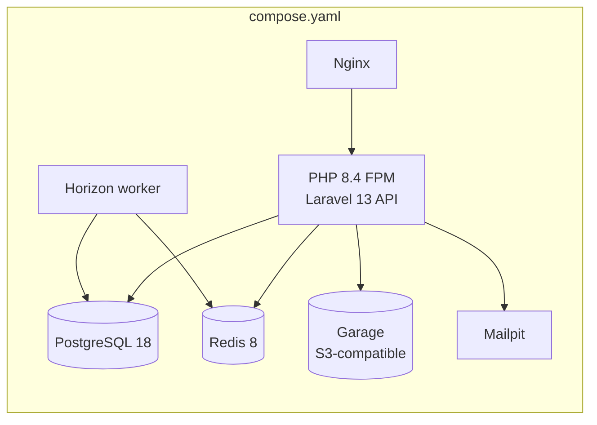

# 07 — Deployment, Observability and Recovery

Status: Baseline — Phase 1 (platform foundation). Derived from the authoritative foundation plan (§3, §12, §22, §25). Local infrastructure lands in execution Phase 2. Production deployment is **Planned — not in Phase 1** (§5 below).

## 1. Local development environment (Docker Compose)

One `compose.yaml` at the repository root starts everything a clean clone needs.

| Service | Purpose | Health check | Persistent volume |
| --- | --- | --- | --- |
| PHP 8.4 FPM | Laravel API runtime (also runs Horizon workers) | Yes | — |
| Nginx | HTTP entry point to FPM | Yes | — |
| PostgreSQL 18 | Platform database | Yes | Yes |
| Redis 8 | Cache, sessions, queues (Horizon) | Yes | Yes |
| Garage | S3-compatible object storage for development | Yes | Yes |
| Mailpit | Local mail capture (verification/reset emails) | Yes | — |

### 1.1 Provisioning duties (execution Phase 2)

* `.env.example` covering every required variable.
* Database initialisation and **role setup** matching the RLS model (plan §11): owner/migrator role; application role **without** `BYPASSRLS` and without `UPDATE`/`DELETE` on `audit_logs`; test role with application-equivalent privileges. No broadly privileged runtime `system` role.
* Object-storage bucket setup on Garage.
* Health checks on all services so `setup` can wait deterministically.

### 1.2 Developer commands (Planned — execution Phase 2)

| Command | Contract |
| --- | --- |
| Setup | Clean clone → running stack: install, start services, migrate, seed |
| Reset | Return the environment to a known-clean state (drop/recreate data volumes as needed) |
| Test | Run the backend and frontend suites locally as CI would |

The Phase 2 gate is: **a clean clone starts successfully**.

### 1.3 Storage abstraction

* **Problem**: Coding against Garage's own APIs couples the application to a dev-only service.
* **Recommendation**: The application uses Laravel filesystem abstractions (S3 driver) exclusively; no Garage-specific API dependencies anywhere.
* **Benefit**: Any S3-compatible production store is a configuration change, not a code change.
* **Implementation impact**: None beyond discipline; Garage is configuration in `compose.yaml` and `.env`.
* **Risk of omission**: Migration to a managed object store becomes a code project.
* **MVP status**: In scope — rule applies from the first stored file.

## 2. Logging

* **Structured JSON** logs from Laravel across all channels.
* Every record passes the **central redaction processor** before emission (see `06-security-privacy-and-audit.md` §2 — redaction is classification-driven, not per-call-site).
* Every record carries the **correlation ID** (`X-Correlation-Id`, server-generated) and, where supplied, the client request ID; queued jobs inherit the originating correlation ID.

## 3. Observability foundation

Honest statement of what exists in Phase 1 versus what does not.

| Capability | Phase 1 status |
| --- | --- |
| Structured JSON logs with redaction | In scope |
| Request correlation end to end (API → logs → queue → audit) | In scope |
| Horizon dashboard (queue throughput, failures, retries) | In scope |
| Service health checks (Compose) | In scope |
| Metrics (application/infrastructure time series) | **Deferred** — no metrics stack in Phase 1 |
| Distributed tracing | **Deferred** |
| Real-user monitoring (web/native) | **Deferred** |
| Alerting | **Deferred** — nothing to alert from until metrics exist |

Deferral is deliberate: with a single deployable and no production traffic, logs + correlation + Horizon answer the questions Phase 1 actually asks. The `infrastructure/monitoring/` directory holds the deferred contract, not speculative tooling (plan §4 rule: no empty packages/directories without a documented deferred contract).

## 4. Backup and recovery — documented design duty

Phase 1 carries a **documentation duty, not implemented automation**. The design that must exist (and be kept honest) covers:

| Concern | Documented design (not automated in Phase 1) |
| --- | --- |
| PostgreSQL | Backup approach and restore procedure appropriate to a single platform database; restore rehearsal expectation recorded |
| Object storage | Bucket contents included in the backup scope |
| Redis | Treated as rebuildable (cache/queues); any exceptions must be called out explicitly |
| Secrets/configuration | Recovery of environment configuration documented |
| RPO / RTO | **Open management decision** — recorded in the open-questions register, no invented targets |

Local development recovery is the `reset` command (§1.2). Production backup automation is scheduled with production deployment, not before.

## 5. Production deployment — Planned, not in Phase 1

No production environment is provisioned in Phase 1. The intended shape, recorded so foundation choices do not preclude it:

| Element | Intended shape |
| --- | --- |
| API | Containerised, **single API deployable** (modular monolith — one artefact for web API, Horizon workers and scheduler; microservices are prohibited in this phase) |
| Native apps | EAS builds of `apps/universal` (`customer`, `staff` families first, per `05-universal-frontend.md` §2) |
| Web | Static web export of `apps/universal` served from a CDN-capable host |
| Data services | Managed PostgreSQL, Redis and S3-compatible storage; the filesystem abstraction (§1.3) and role model (§1.1) transfer unchanged |
| CI/CD | The three CI workflows (`08-testing-and-quality.md` §4) are the promotion gate; deployment automation itself is Planned — post-Phase 1 |

Anything more specific (hosting provider, regions, scaling policy) is an open decision and is intentionally not fabricated here.
