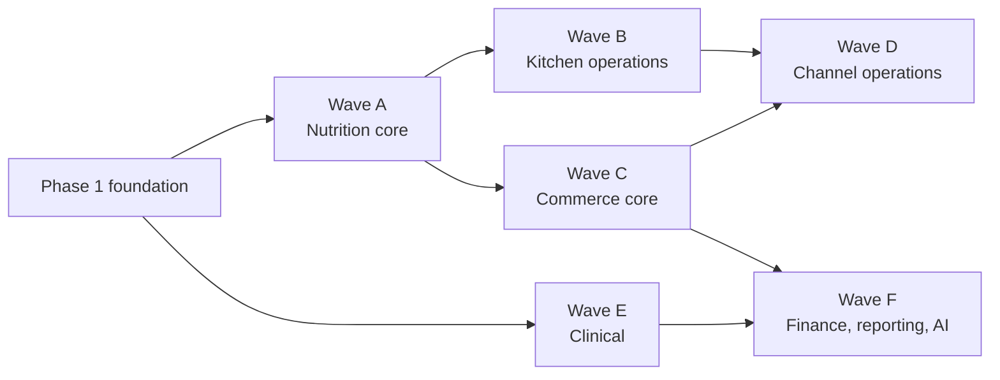
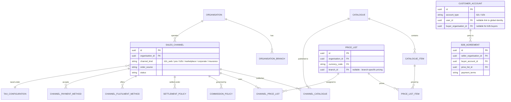
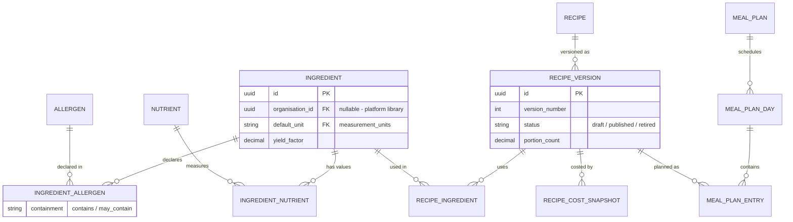
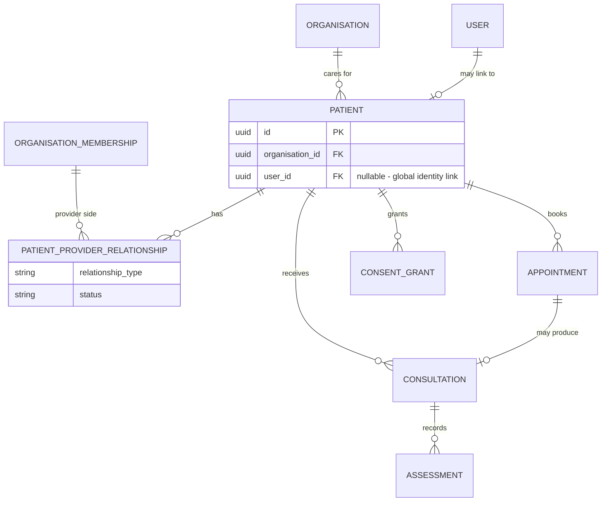
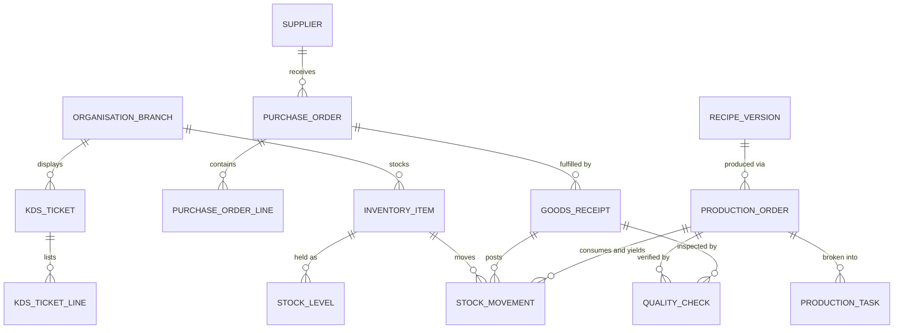

# 09 — Future Module Roadmap

Status: Registry of documented future modules (authoritative foundation plan §6, §7, §10, §28). Nothing in this document is implemented in Phase 1. Rules:

* Future modules are **registry entries only** — no empty directories, no speculative classes, no migrations (plan §6, §7).
* Kitchen and commercial permissions remain registry proposals until their modules are implemented (plan §10).
* Every ER sketch below is **PROPOSED — do not migrate in Phase 1**.
* Each module is designed individually, after the platform foundation and reference UI prototype are approved (plan §28).

## 1. Indicative sequencing

Sequencing is dependency-driven and **indicative, not a commitment**; product priorities (for example bringing Clinical forward) may reorder waves that do not depend on each other.

## 2. Module register

Foundation modules referenced below: Support, ReferenceData, Localisation, Identity, Organisations, Tenancy, AccessControl, Features, Consent, Audit, PlatformAdministration.

### Wave A — Nutrition core

| Module | Scope | Key future concepts | Foundation dependencies |
| --- | --- | --- | --- |
| Ingredients | Master ingredient registry: organisation-owned ingredients with an optional shared platform library, bilingual naming, units and yield/waste factors. The reference point for allergens, nutrition, recipes and (later) inventory. | Ingredient, unit conversion, yield factor, platform vs organisation ownership | ReferenceData (measurement units), Tenancy, Localisation |
| Allergens | Allergen registry and declaration model: containment levels (contains / may contain), propagation from ingredients through recipes to sellable items, customer-facing warnings. | Allergen, declaration, propagation rule | Localisation (bilingual regulatory wording), ReferenceData |
| Nutrition | Nutrient definitions and the calculation engine: per-100g and per-serving values, reference intakes, aggregation from ingredients to recipes, meals and plans. | Nutrient, nutritional value, reference intake, calculation profile | ReferenceData, Ingredients, configurable numbering (see `05-universal-frontend.md` §8) |
| Recipes | Versioned recipes with ingredient lines, steps and portioning; costing snapshots per version; nutrition and allergen roll-ups computed per version, never mutated in place. | Recipe version, costing snapshot, portioning, roll-up | Ingredients, Identity/Audit (authorship trail), Tenancy |
| MealPlanning | Meal plans composed of days and entries referencing recipe versions; templates; later assignment to patients/customers. | Meal plan, plan day, plan entry, template | Recipes, AccessControl; later ClinicalRecords relationships |

### Wave B — Kitchen operations

| Module | Scope | Key future concepts | Foundation dependencies |
| --- | --- | --- | --- |
| Kitchens | Kitchen operating profiles for organisations and branches: stations, capacity, operating hours, production calendars. | Kitchen profile, station, capacity | Organisations/branches, Features (capability gating) |
| Inventory | Stock items, per-branch/location levels and a movement ledger; valuation method deferred to design time. | Stock level, movement ledger, valuation basis | Tenancy, Audit, Ingredients |
| Procurement | Suppliers, purchase orders, goods receipts and supplier pricing. | Supplier, purchase order, goods receipt | ReferenceData (currencies), Audit |
| Production | Production orders derived from recipe versions; task breakdown; consumption and yield posted to inventory. | Production order, batch, yield posting | Recipes, Inventory, Kitchens |
| QualityControl | Quality checks on goods receipts and production batches; hold/release states; hygiene and temperature logging later. | Quality check, hold/release | Production, Procurement, Audit |

### Wave C — Commerce core

| Module | Scope | Key future concepts | Foundation dependencies |
| --- | --- | --- | --- |
| Catalogues | Sellable catalogue items decoupled from recipes; publication to sales channels with availability windows. | Catalogue, catalogue item, channel availability | Tenancy, Localisation, Recipes (optional source) |
| Pricing | Price lists per currency with optional branch scope; assignment of price lists to channels; promotions later. | Price list, branch-specific price, channel assignment | ReferenceData (currencies), Catalogues |
| Marketplace | Multi-vendor storefront where partner organisations list offerings under platform commission and settlement policies. | Vendor listing, commission policy, settlement policy | Organisations (partner type), Features/entitlements, Catalogues, Pricing |
| B2B | Business customer accounts, agreements, negotiated price lists, credit/payment terms and order approval workflows. | B2B account, agreement, payment terms, approval flow | Organisations, AccessControl, Pricing |
| Cart | Cart lifecycle per channel and customer account; re-validation of availability and price on transition to checkout. | Cart, cart line, price validation | Catalogues, Pricing |
| Orders | Order capture across all channels: order source, fulfilment method, order state machine, idempotent placement. | Order, order source, fulfilment method, state machine | `idempotency_keys` (foundation table), Audit, Cart |
| Subscriptions | Customer-facing recurring subscriptions (meal plans, products): schedules, pauses/skips, renewals. Distinct from the foundation's `organisation_subscriptions` (platform feature billing). | Subscription, schedule, pause/skip, renewal | Orders, Payments, MealPlanning |
| Payments | Payment intents, methods, captures and refunds through market-appropriate providers; the platform never stores card data and never places payment payloads in audit metadata (`06-security-privacy-and-audit.md` §3.2). | Payment intent, payment method, refund | ReferenceData (currencies), Audit, Orders |

### Wave D — Channel operations

| Module | Scope | Key future concepts | Foundation dependencies |
| --- | --- | --- | --- |
| POS | In-person point of sale for the `kiosk` build family: registers, shifts, POS transactions. Blocked on hardware and an approved offline threat model (plan §21). | Register, shift, POS transaction | Orders, Pricing, kiosk build family |
| KitchenDisplay | KDS ticket flow from orders to kitchen stations: routing, timing, bump states. Same offline caveat as POS. | Ticket, station routing, bump state | Orders, Kitchens, kiosk build family |
| Delivery | Delivery jobs, driver assignment, tracking states and proof of delivery via the `driver` build family. | Delivery job, assignment, tracking state | Orders, driver build family |

### Wave E — Clinical

| Module | Scope | Key future concepts | Foundation dependencies |
| --- | --- | --- | --- |
| ClinicalRecords | Patient records, patient-provider relationships, consultations and assessments — all under consent, purpose-of-use and sensitive-data classification controls. Relationship and consent checks stay separate authorisation concerns with distinct denial reasons (plan §10). | Patient, patient-provider relationship, consultation, assessment | Consent, Audit (purpose-of-use), AccessControl, Identity |
| Appointments | Scheduling between patients and providers: availability, booking, reminders, cancellation. | Appointment, availability, reminder | Identity, Organisations/memberships, ClinicalRecords |

### Wave F — Finance, reporting and AI

| Module | Scope | Key future concepts | Foundation dependencies |
| --- | --- | --- | --- |
| Accounting | Financial postings from orders, payments, commissions and settlements into an exportable ledger. | Journal, posting rule, export | Payments, Orders, Marketplace |
| Reporting | Operational and business reporting over defined read models; no ad-hoc cross-tenant table access — read paths respect RLS. | Read model, report definition, export | All reported-on modules, Tenancy/RLS |
| ArtificialIntelligence | AI-assisted features (meal-plan suggestions, nutrition insights) gated by consent, classification and purpose-of-use; every suggestion access is auditable. | Model integration, suggestion audit, consent gating | Consent, Audit, Nutrition, ClinicalRecords |

## 3. Proposed ER sketches

All four sketches are design aids for boundary conversations. **PROPOSED — do not migrate in Phase 1** (plan §7: proposed future tables may appear in ERDs but must not be migrated).

### 3.1 Commerce-channel model — PROPOSED — do not migrate in Phase 1

Target scenario: one kitchen sells simultaneously through B2C web, POS, B2B, the marketplace and corporate/insurance programmes, with branch-specific pricing.

### 3.2 Nutrition and recipes — PROPOSED — do not migrate in Phase 1

### 3.3 Clinical — PROPOSED — do not migrate in Phase 1

`CONSENT_GRANT`, `USER`, `ORGANISATION` and `ORGANISATION_MEMBERSHIP` are foundation tables shown for context only. All clinical access is subject to relationship and consent checks as separate authorisation concerns, purpose-of-use recording, and sensitive-data classification.

### 3.4 Kitchen operations — PROPOSED — do not migrate in Phase 1

## 4. Commerce concepts the foundation must not preclude

* **Problem**: Foundation-era shortcuts (single-currency assumptions, "customer = user", price on the product row) would force schema rewrites when commerce modules arrive.
* **Recommendation**: Phase 1 makes no commerce schema, but its design must keep the following concepts representable later without breaking changes.
* **Benefit**: Commerce waves are additive, not corrective.
* **Implementation impact**: Nil code in Phase 1 — this is a review checklist for foundation migrations and API contracts.
* **Risk of omission**: The one-kitchen-many-channels scenario (§3.1) becomes unimplementable without destructive migration.
* **MVP status**: Checklist active from Phase 1; concepts themselves are Planned — Waves C/D.

| Concept | What the foundation must keep open |
| --- | --- |
| Sales channel | Selling context is an entity, never an enum burned into orders-adjacent foundations |
| Customer type | B2C and B2B customers differ structurally; "customer" is not synonymous with "user" |
| B2C / B2B accounts | A customer account may link to a global user (B2C) or to a buyer organisation (B2B) |
| Price list | Prices live in lists, not on product rows; multiple concurrent lists per seller |
| Channel availability | An item can be available on some channels/branches and not others |
| Currency | Multi-currency from the start — `currencies` reference table is already seeded in the foundation; no single-currency assumptions in shared code |
| Tax configuration | Tax rules vary by market (nine launch countries); `tax_jurisdictions` is deferred but must remain attachable |
| Order source | Orders record where they originated (web, POS, marketplace, B2B, programme) |
| Fulfilment method | Delivery, pickup, dine-in etc. are data, not code paths |
| Payment method | Multiple methods per channel; method is distinct from provider |
| Settlement policy | Marketplace/partner payouts follow configurable policies |
| Commission policy | Platform commissions are configurable per channel/partner, not hard-coded |
