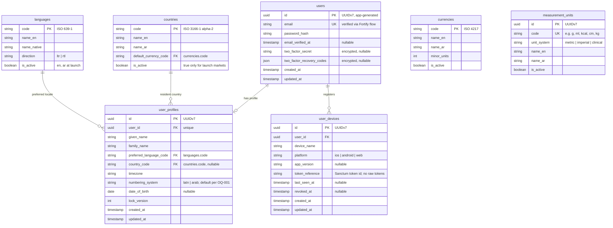
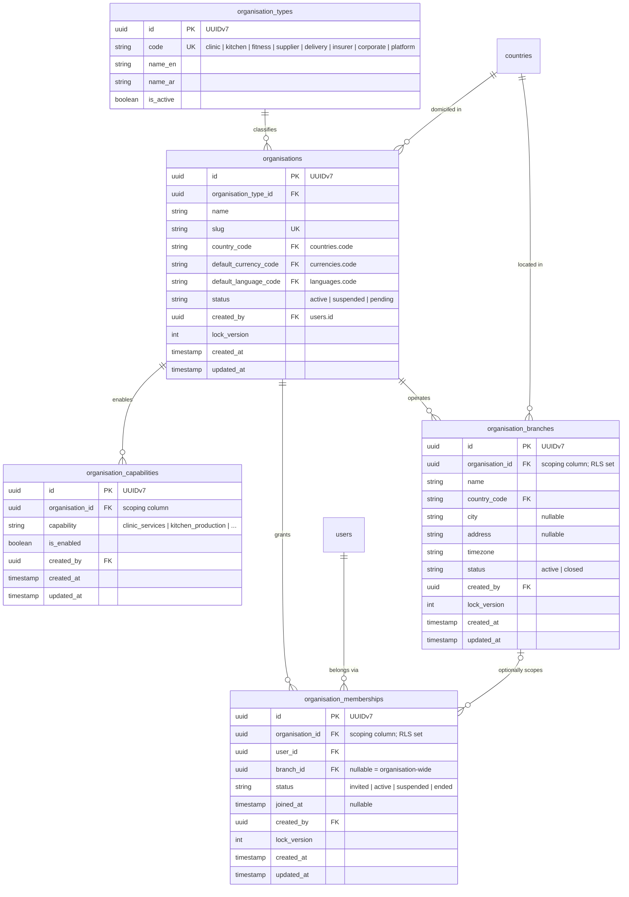
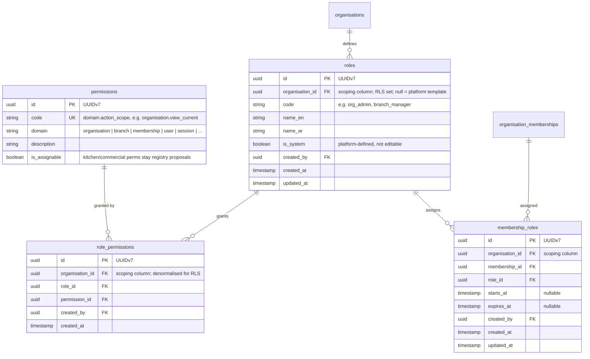

# Foundation ERD — 23 tables

Entity-relationship views of the foundation database scope (plan §7). Only these tables are migrated in the foundation phase; deferred tables (tax, integrations, webhooks, billing, commissions, settlements, kitchen, nutrition, clinical) may appear in future ERDs but are **not** migrated now. Classifications and PII flags: `docs/registers/data-register.md`.

## Conventions

- **Primary keys**: UUIDv7, application-generated through the central Healthy360 identifier service — except stable reference tables, which use ISO codes as natural PKs (`countries.code` ISO 3166-1 alpha-2, `currencies.code` ISO 4217, `languages.code` ISO 639-1).
- **Tenant scoping**: tenant-owned tables carry `organisation_id`, plus `branch_id` where branch-scoped.
- **Stewardship columns**: `created_by` (user UUID) and `created_at`/`updated_at` timestamps on all non-reference tables (shown once here, elided from diagrams where noise outweighs value).
- **Optimistic concurrency**: `lock_version` integer on tables where concurrent edits matter (profiles, organisations, branches, memberships, entitlements, subscriptions); these resources honour `If-Match` (see `docs/api/conventions.md`).
- `audit_logs` is append-only; the application database role cannot update or delete rows.

## 1. Identity and reference data

`currencies ||--o{ countries : "default currency"` also holds; drawn from the countries side above to keep the diagram readable.

## 2. Organisations and tenancy

## 3. Access control

Permission calculation is cached per user × organisation × branch and invalidated by a permission-version counter (plan §10) — the counter lives in cache, not in these tables.

## 4. Features, consent and operational controls

```mermaid
erDiagram
    feature_definitions ||--o{ feature_entitlements : "entitles"
    organisations ||--o{ feature_entitlements : "holds"
    organisations ||--o{ organisation_subscriptions : "subscribes"
    consent_definitions ||--o{ consent_grants : "granted as"
    users ||--o{ consent_grants : "grants"
    organisations |o--o{ consent_grants : "in context of"
    users ||--o{ audit_logs : "acted (actor)"
    organisations |o--o{ audit_logs : "tenant context"
    users ||--o{ idempotency_keys : "issued"

    feature_definitions {
        uuid id PK "UUIDv7"
        string code UK "e.g. feature.two_factor_enforcement"
        string name_en
        string name_ar
        string description
        boolean is_active
    }

    feature_entitlements {
        uuid id PK "UUIDv7"
        uuid organisation_id FK "scoping column; RLS set"
        uuid feature_definition_id FK
        string status "enabled | disabled | trial"
        timestamp starts_at "nullable"
        timestamp expires_at "nullable"
        uuid created_by FK
        int lock_version
        timestamp created_at
        timestamp updated_at
    }

    organisation_subscriptions {
        uuid id PK "UUIDv7"
        uuid organisation_id FK "scoping column"
        string package_code "billing detail deferred"
        string status "trial | active | lapsed | cancelled"
        timestamp starts_at
        timestamp ends_at "nullable"
        uuid created_by FK
        int lock_version
        timestamp created_at
        timestamp updated_at
    }

    consent_definitions {
        uuid id PK "UUIDv7"
        string code "e.g. consent.terms, consent.data_processing"
        int version "versioned text"
        string purpose
        string body_en
        string body_ar
        boolean is_active
        timestamp created_at
    }

    consent_grants {
        uuid id PK "UUIDv7"
        uuid user_id FK
        uuid consent_definition_id FK
        uuid organisation_id FK "nullable; scoping column; RLS set"
        string status "granted | withdrawn"
        timestamp granted_at
        timestamp withdrawn_at "nullable"
        string channel "web | ios | android"
        timestamp created_at
    }

    audit_logs {
        uuid id PK "UUIDv7"
        uuid actor_user_id FK "nullable for system events"
        uuid organisation_id FK "nullable; scoping column; RLS set"
        uuid branch_id FK "nullable"
        string action "safe audit-event contract"
        string subject_type
        uuid subject_id "nullable"
        string purpose_of_use "required for sensitive accesses"
        string correlation_id "matches X-Correlation-Id"
        json metadata "redacted; never secrets, bodies or medical content"
        timestamp occurred_at
    }

    idempotency_keys {
        uuid id PK "UUIDv7"
        string key UK "client-supplied Idempotency-Key"
        uuid user_id FK
        uuid organisation_id FK "nullable; scoping column"
        string endpoint "scoped per endpoint"
        string request_fingerprint "hash; no request bodies stored"
        string response_status
        json response_snapshot "envelope only, redacted"
        timestamp expires_at
        timestamp created_at
    }
```

## Notes

- Column lists are the architectural contract (keys, scoping, stewardship, concurrency); exact nullable/index details are finalised in migrations and must not contradict this document without updating it.
- Tables named in the RLS representative set (`organisation_branches`, `organisation_memberships`, `roles`, `feature_entitlements`, `consent_grants`, `audit_logs`) are marked "RLS set" (ADR-0007).
- `users`, reference tables, `permissions` and `feature_definitions` are platform-global and carry no organisation scoping.
